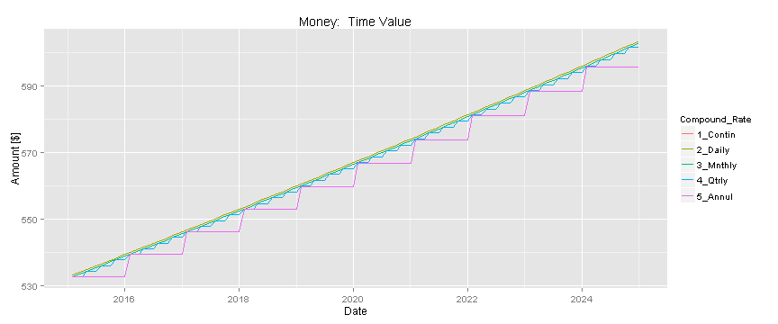

## Outline
### Tools:  
1. Programming Environment
2. Probability
3. Calculus

### Finance Theory:  
1. Future Value of Money
2. Option Pricing with Binomial Tree Pricing Model
3. Stock Pricing within Framework of Wiener Process

### Conclusions

### Acknowledgements

--- .class #id

## Programming Environment

### R is a free statistical software package with integrated graphics
* [Open Source Code](http://cran.r-project.org/), Shared Libraries, & [Integrated Development Environment](http://www.rstudio.com/) 

* [Plotting](http://ggplot2.org/), [LaTex](http://www.latex-project.org/) for equations, & [Slide Presentations](https://github.com/ramnathv/slidifyExamples)

### Version Control
* [Git](https://www.git-scm.com) invented by Linus Torvalds (open source Linux)
* [Git Hub](https://github.com/RobertTwesten/Tristan) distributed version control ([used by Google](https://github.com/google))

---
## Tools from Calculus

### Definition of $e$

\begin{equation}
e = \lim_{n\to\infty} (1 + 1/n)^n
\end{equation}

### Integration

* Assume a [linear measure]( http://en.wikipedia.org/wiki/Measure_(mathematics\) ) in $\Re^1$, then
\begin{equation}
\int dx = x + C
\end{equation}

### Total Derivative

* Let $f$ be a function of $x(t)$, $y(t)$, and $t$. The total derivative with respect to time is

\begin{equation}
\frac{d f(x(t), y(t), t)}{d t} = \frac{\partial f}{\partial x} \frac{d x}{d t} + \frac{\partial f}{\partial y} \frac{d y}{d t}
+ \frac{\partial f}{\partial t} \frac{d t}{d t}
\end{equation}

---
## Tools from Probability (1 / 4)

### Recall
* Given a set of observations $\{x_i\}$, the mean is

\begin{equation}
\mu =  \sum_{i=1}^{n} \frac{x_i}{n}
\end{equation}

* The variance (a measure of disorder) is

\begin{equation}
\sigma^2  =  \sum_{i=1}^n \frac{(x_i - \mu)^2}{n}
\end{equation}

\begin{equation}
\vdots
\end{equation}

\begin{equation}
\sigma^2  =  \langle x^2 \rangle - \langle x \rangle^2
\end{equation}

---
## Tools from Probability (2 / 4)
### Normal Distribution
* Density is

\begin{equation}
f(x) = \frac{1}{\sqrt{2 \pi} \sigma} e^{-(x - \mu)^2/2 \sigma^2}
\end{equation}

* Lineshape of density centered at $\mu$ with [FWHM](https://en.wikipedia.org/wiki/Full_width_at_half_maximum) $= 2\sqrt{2 ln2} \sigma$
* Expectation value of x is

\begin{equation}
E(x) = \langle x \rangle = \int_{-\infty}^{-\infty} x \frac{1}{\sqrt{2 \pi} \sigma} e^{-(x - \mu)^2/2 \sigma^2} dx
\end{equation}

### Standard Normal Distribution
* Definition: $\mu = 0$ &  $\sigma^2 = 1$

---
## Tools from Probability (3 / 4)
### Monte Carlo Data, Binomial Distribution, & Cental Limit Theorm
* Left, mid, and right panels show $2$, $2^8$, and $2^{16}$ samples from 1000 simulations
* Data are normalized.  Solid line shows density for standard normal.

<video   controls loop><source src="assets/fig/CLTbinom-.webm" />video of chunk CLTbinom</video>
* In limit, binomial distribution can be approximated by normal distribution

---
## Tools from Probability (4 / 4)
### [Stochastic Processes](http://en.wikipedia.org/wiki/Stochastic_process): observations whose values are random with respect to time

### Markov Process
* Future stock price depends only on current price.
* Distributions are normal. Means are additive. Variances are additive.

### Wiener Process

* Future stock price depends only on current price.
* Distributions are standard normal, i.e. $\mu = 0$ &  $\sigma^2 = 1$.

---
## Tools from Stochastic Calculus

### Ito's Lemma
* Show definition of Ito's lemma

---
## Definitions from Finance

### Stock
* An asset representing partial ownership of a publicly traded firm.

### American Option
* Right to buy (long) or sell (short) an asset at strike price $S_k$ at any time until maturity for a premium.

### European Option
* Right to buy (long) or sell (short) an asset at strike price $S_k$ at maturity for a premium.

### Call Option
* Option to buy an asset at strike price $S_k$ at maturity for a premium.

### Put Option
* Option to sell an asset at strike price $S_k$ at maturity for a premium.

---
## Future Value of Money
### Annual Compounding vs Continuous Compounding
* $r =$ risk free interest rate
* $PV =$ Present Value of Money
* $FV =$ Future Value of Money
* With annual compounding, $FV_1 = PV (1 + r)$

* Decreasing compouding interval by $n$ causes
$$ FV_t = PV(1+\frac{r}{n})^{nt} $$
* Letting $n \rightarrow \infty$,
$$ FV_t \lim_{n\to\infty} PV(1+\frac{r}{n})^{\frac{n}{r} rt} $$

$$ FV_t = PV e^{rt} $$

---
## Future Value of Money

* [Bank Savings interest rate](http://www.mysavingsdirect.com/MySavingsDirectWeb/en/common/information/LearnMore.jsp) $r = 1.25\%$ per annum. Starting balance = [$532.60](http://www.google.com/finance?q=NASDAQ%3AGOOGL&ei=fsF9VfG5JonSjAGE84J4)
* Figure shows continuous, daily, monthly, quarterly, and annual compounding for 10 years
 
* Bank income is bounded by continuous compounding curve and client's compounding curve

---
## Risk Neutral Valuation of a Portfolio

### Assumptions
1. Expected return on a stock (or any other instrument) is the risk-free rate $e^{rt}$.
2. Discount rate for payoff on an option (or any other instrument) is the risk-free rate $e^{-rt}$.

### Purpose
1. Risk Neutral Valuation (RNV) simplifies pricing.

* All returns and discounts are at risk-free rate.

2. **Relationship between stock and derivative is the same regardless of risk**.

* Risk incorporated into price of stock.

---

## Portfolio Management (1 / 4)

### Generate RNV Portfolio using [Binary Tree Model](https://en.wikipedia.org/wiki/Binomial_options_pricing_model)
1. Purchasing $\Delta$ shares of stock at price $S_o$
2. Short a call option on same stock with value $f$

* Value of RNV portfolio is same whether stock price goes up or down

\begin{equation}
(\Delta S_o) u - f_u = (\Delta S_o) d - f_d
\end{equation}
where u is the multiplier  for increase and d is multiplier for decrease

### $\Delta$ Hedge for RNV Portfolio
* From equality, $\Delta$ required for creating a RNV Portfolio is

\begin{equation}
\Delta = \frac{f_u - f_d}{S_o (u-d)}
\end{equation}

---
## Portfolio Management (2 / 4)

### The figure depicts a RNV portfolio generated from Binary Tree Model

<iframe src="diagram.html" width=100% height=100% allowtransparency="true"> </iframe>

---
## Portfolio Management (3 / 4)

* PV of RNV is discounted FV, i.e.

\begin{equation}
(\Delta S_o)  - f = e^{-r t} \left[ (\Delta S_o) u - f_u \right]
\end{equation}

* Solving for f estimates PV of call option, so
\begin{equation}
\vdots
\end{equation}

\begin{equation}
f = e^{-r t} \left[ p f_u + (1 - p) f_d \right]
\end{equation}

where

\begin{equation}
p = \frac{e^{r t} - d}{u - d}
\end{equation}

* **NOTE**:  f is discounted expectation value of option's FV against a binomial density (*coin flip*)

---
## Portfolio Management (4 / 4)

### For stochastic processes, variance is proportional to $\Delta t$, so

\begin{equation}
\sigma^2 \Delta t = \langle S(t)^2 \rangle - \langle S(t) \rangle ^2
\end{equation}

\begin{equation}
\vdots
\end{equation}

\begin{equation}
\sigma^2 \Delta t = \left[ p u^2 + (1-p) d^2 \right] - \left[ \left( p u + (1-p) d \right)^2 \right]
\end{equation}

\begin{equation}
\vdots
\end{equation}

\begin{equation}
\sigma^2 \Delta t = (u + d) e^{\mu t} - du - e^{2 \mu t}
\end{equation}

* with a Taylor Expansion, one validates a solution for u & d is $u = e^{\sigma \sqrt{\Delta t}}$ & $d = e^{- \sigma \sqrt{\Delta t}}$

---
## Pricing a Stock

### Summary
* Given a RNV Portfolio, binary tree model prices a call option within a $\Delta$ Hedge
* Binary tree model transforms from *RNV world* to *real market* by incorporating market return $\mu$ and volatility $\sigma^2 \Delta t$ in price multipliers $u$ & $d$

### Next Steps
* Determine time dependence of stock price $S$
* Two assumptions are:

1.  $\Delta z$ during a small time interval $\Delta t$ is $\Delta z = \epsilon \sqrt(\Delta t)$ where $\epsilon$ is a standard normal distribution.
2.  Values of $\Delta z$ from any two time intervals $\Delta t$ are mutually independent.

---
## Time Dependence of $S$

\begin{equation}
d S = \mu S d t + \sigma S \epsilon \sqrt{dt}
\end{equation}

* Neglecting volatility, $S(t) = S_o e^{\mu t}$. Solving numerically,
\begin{equation}
\vdots
\end{equation}

\begin{equation}
\Delta S = \mu S \Delta t + \sigma S \epsilon \sqrt{\Delta t}
\end{equation}

\begin{equation}
\vdots
\end{equation}

\begin{equation}
S_{i + 1} = S_i + \mu S_i \Delta t + \sigma S_i \epsilon \sqrt{\Delta t}
\end{equation}

---
## Hedge Fund

### Concepts are assembled
* Pricing model for European Options using Binomial Tree
* Pricing model for a stock using a Wiener Process
* Future Value of Money
* RNV Portfolio

### Hedge Fund functions similarly to a savings account

\begin{equation}
FV = e^{\mu t} PV
\end{equation}

### Comments
* This is basis for [top 25 fund managers earning more income than all kindergarten teachers in US](http://www.washingtonpost.com/blogs/the-fix/wp/2015/05/12/the-top-25-hedge-fund-managers-earn-more-than-all-kindergarten-teachers-combined/)
* CAUTION:  models discussed are simple; trading errors bankrupt institutions

---
## Google vs Savings Account vs Hedge Fund
### Numerical estimate and actual stock price of Google (Dates:  1/2/2015 - 6/12/2015)
<video   controls loop><source src="assets/fig/stockPricing-.webm" />video of chunk stockPricing</video>
* Volatility in actual and predicted price for Google stock is manifest

---
## Conclusions

### Optimizing FV of savings requires large $r$ and short compounding intervals
*  Compounding intervals range range from daily, $\ldots$, or annual

### Stock speculation provides large gains, but with large risks

### Binary Tree model enables pricing a call option for $\Delta$ Hedging.

### Binary Tree model with Wiener Process enables stock pricing
* Wiener process informs about inherent volatility of stock price

### $\Delta$ Hedging enables earning income at market rate $\mu$ with negligible risk
* Ratio between Google's rate of return and best available bank rate is $\mu / r =$ ``7.28``
* High frequency trading rate is of order $1 \mu s$

---
## Acknowledgements

### M Galletta
### K Tate
### C Dillman
### K Twesten

## References
* Hull, J.C., **Options, Futures, And Other Derivatives**, 8th ed., Pearson Education Limited, England (2012)

